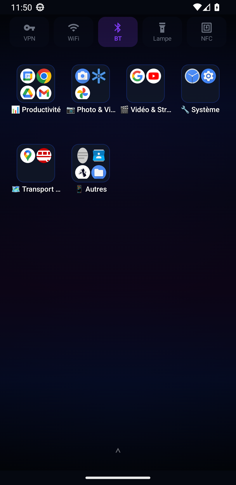
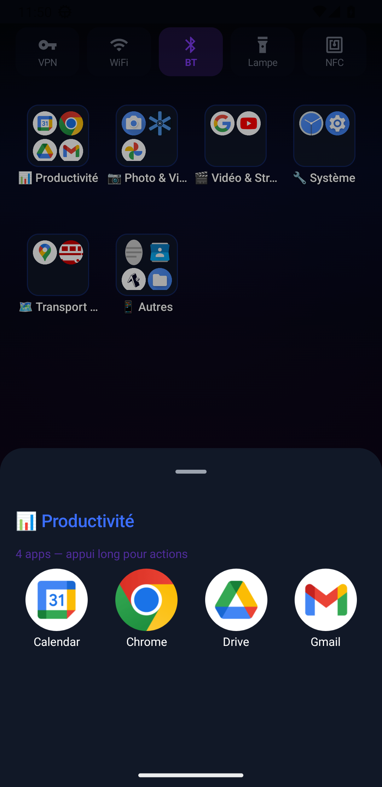
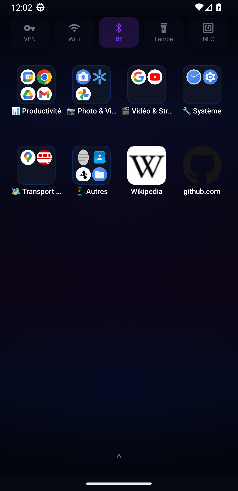
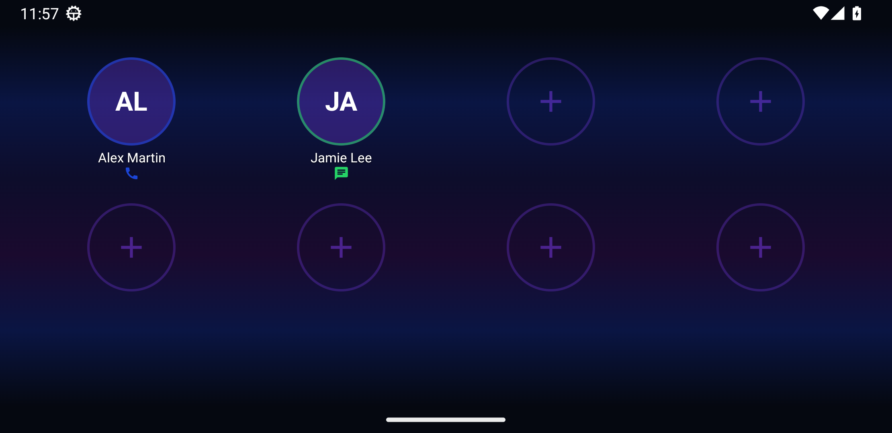

# DeskZen

A smart Android launcher that automatically organizes your apps into themed
folders with a local heuristic categorizer, wrapped in a customizable dark UI
inspired by *Solo Leveling*.

Kotlin · Jetpack Compose · MVVM · Hilt.



---

## Screenshots

| | |
|---|---|
|  |  |
| **Home** — paginated grid, auto-organized folders and the Wi-Fi/Bluetooth/VPN/NFC/flashlight toggles bar. | **Smart folders** — a folder auto-built by the local heuristic categorizer, opened to show its apps. |
|  |  |
| **Web shortcuts** — add any URL; the favicon and page title are fetched automatically. | **Landscape quick contacts** — 4×2 speed-dial grid with per-contact call / WhatsApp / SMS actions. |

> Screenshots captured on an Android emulator with demo apps and fictional contacts.

---

## Features

### Home screen
- **Paginated grid** – apps are spread across swipeable pages (up to 20 icons per page).
- **Smart folders** – themed folders (Social, Finance, Games, Music…) are proposed
  automatically by a local heuristic categorizer — no network, no cloud.
- **Custom folders** – create, rename and delete your own folders.
- **Drag & drop** – move icons around, or drop one icon onto another to create a folder.
- **Web shortcuts** – add links to the home screen; the favicon and page title are
  fetched automatically. `http://` and `https://` are both supported.
- **Long-press on an empty cell** – add a web shortcut or change the wallpaper.
- **Double-tap Home** – jump back to the first page.

### App drawer
- Swipe up to open a full drawer of installed apps with real-time search.

### Quick toggles bar
- One-tap access from the home screen to Wi-Fi, Bluetooth, VPN (Tailscale),
  NFC and the flashlight.

### Landscape quick contacts
- In landscape, a 4×2 grid of speed-dial contacts with phone call, WhatsApp
  call/message and SMS actions, each with a contact photo you can crop.

### Notification badges
- Unread-count badges on app icons via a `NotificationListenerService`.

### Backup / restore
- Export and import the full layout as a JSON file (custom folders, manual
  placements, standalone apps, web shortcuts, and contact photos).

---

## Tech stack

| Layer | Technology |
|-------|-----------|
| Language | Kotlin 2.1.0 |
| UI | Jetpack Compose (BOM 2025.01.00) · Material 3 |
| Architecture | MVVM · `StateFlow` |
| Dependency injection | Hilt 2.53 |
| Persistence | `SharedPreferences` + JSON files (no database) |
| Categorization | Local heuristic engine (no ML runtime, no network) |
| Logging | Timber 5.0.1 (debug builds only) |
| Build | AGP 8.7.3 · Gradle 8.11.1 · KSP · JDK 17 |
| Tests | JUnit 4 · MockK · Coroutines Test |

---

## Architecture

`MainActivity` hosts a single Compose screen, `LauncherScreen`, driven by a
central `LauncherViewModel` that exposes a `StateFlow<LauncherUiState>`.

```
com.deskzen/
├── MainActivity.kt            # Single-activity launcher entry point
├── ui/
│   ├── launcher/              # LauncherScreen + LauncherViewModel, app drawer,
│   │                          # dock, folder manager, quick toggles, backup
│   ├── contacts/              # Landscape quick-contacts grid + config dialog
│   ├── organize/              # Drag & drop state (DragState, DropTarget)
│   ├── components/            # Reusable composables (AppIcon, PageIndicator)
│   └── theme/                 # Solo Leveling dark theme
├── domain/model/             # AppInfo, ScreenItem (sealed), QuickContact, ThemeSuggestion
├── data/repository/          # AppRepository (PackageManager), NotificationRepository
├── ai/                       # HeuristicCategorizer (multi-level app categorization)
├── service/                  # NotificationBadgeService (NotificationListenerService)
└── di/                       # Hilt module
```

### Core data model

```kotlin
sealed interface ScreenItem {
    data class AppShortcut(val position: Int, val appInfo: AppInfo) : ScreenItem
    data class Folder(val position: Int, val name: String, val apps: List<AppInfo>, ...) : ScreenItem
    data class WebShortcut(val position: Int, val url: String, val label: String, val favicon: Bitmap?) : ScreenItem
}
```

### Categorization

`HeuristicCategorizer` classifies apps with no ML runtime and no network, in
three passes: Android launcher category → package-name patterns → label keywords.

### Persistence

State is stored in `SharedPreferences` (`deskzen_prefs`, `deskzen_dock`,
`deskzen_contacts`) plus JSON/asset files in the app's private storage. User
backups are a single JSON document written to `filesDir`.

---

## Build & install

### Requirements
- Android Studio (Hedgehog or newer)
- JDK 17 (e.g. Microsoft Build of OpenJDK 17)
- Android SDK 35 · **minSdk 28**

Create a `local.properties` at the repo root pointing at your SDK (this file is
gitignored and must never be committed):

```
sdk.dir=/absolute/path/to/Android/Sdk
```

### Build

```bash
# Debug
./gradlew assembleDebug
adb install app/build/outputs/apk/debug/app-debug.apk

# Release (R8 minify + resource shrinking)
./gradlew assembleRelease
```

### Set as the default launcher
1. Install the APK.
2. Press the Home button.
3. Choose **DeskZen** → *Always*.

---

## Theme

A custom dark theme inspired by the *Solo Leveling* anime:
- Background: deep black `#0A0A0F`
- Primary accent: electric blue `#4FC3F7`
- Secondary accents: purple `#9C27B0` / cyan `#00BCD4`
- Material 3 typography tuned for small screens.

---

## License

Released under the [MIT License](LICENSE).
